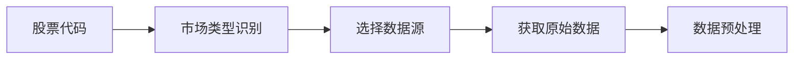
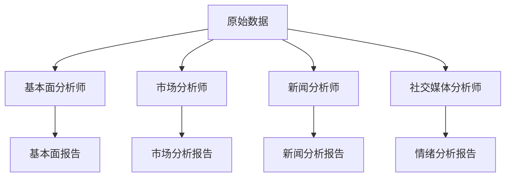
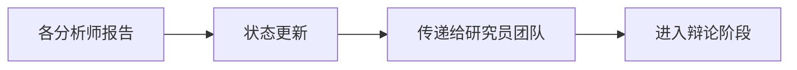

# 分析师团队

## 概述

分析师团队是 TradingAgents 框架的核心分析组件，负责从不同维度对股票进行专业分析。团队由四类专业分析师组成，每个分析师都专注于特定的分析领域，通过协作为投资决策提供全面的数据支持。

## 分析师架构

### 基础分析师设计

所有分析师都基于统一的架构设计，使用相同的工具接口和日志系统：

```python
# 统一的分析师模块日志装饰器
from tradingagents.utils.tool_logging import log_analyst_module

# 统一日志系统
from tradingagents.utils.logging_init import get_logger
logger = get_logger("default")

@log_analyst_module("analyst_type")
def analyst_node(state):
    # 分析师逻辑实现
    pass
```

### 智能体状态管理

分析师通过 `AgentState` 进行状态管理：

```python
class AgentState:
    company_of_interest: str      # 股票代码
    trade_date: str              # 交易日期
    fundamentals_report: str     # 基本面报告
    market_report: str           # 市场分析报告
    news_report: str             # 新闻分析报告
    sentiment_report: str        # 情绪分析报告
    messages: List              # 消息历史
```

## 分析师团队成员

### 1. 基本面分析师 (Fundamentals Analyst)

**文件位置**: `tradingagents/agents/analysts/fundamentals_analyst.py`

**核心职责**:
- 分析公司财务数据和基本面指标
- 评估公司估值和财务健康度
- 提供基于财务数据的投资建议

**技术特性**:
- 使用统一工具架构自动识别股票类型
- 支持A股、港股、美股的基本面分析
- 智能选择合适的数据源（在线/离线模式）

**核心实现**:
```python
def create_fundamentals_analyst(llm, toolkit):
    @log_analyst_module("fundamentals")
    def fundamentals_analyst_node(state):
        ticker = state["company_of_interest"]
        
        # 获取股票市场信息
        from tradingagents.utils.stock_utils import StockUtils
        market_info = StockUtils.get_market_info(ticker)
        
        # 获取公司名称
        company_name = _get_company_name_for_fundamentals(ticker, market_info)
        
        # 选择合适的工具
        if toolkit.config["online_tools"]:
            tools = [toolkit.get_stock_fundamentals_unified]
        else:
            # 离线模式工具选择
            tools = [...]
```

**支持的数据源**:
- **A股**: 统一接口获取中国股票信息
- **港股**: 改进的港股工具
- **美股**: FinnHub、SimFin等数据源

### 2. 市场分析师 (Market Analyst)

**文件位置**: `tradingagents/agents/analysts/market_analyst.py`

**核心职责**:
- 技术指标分析（RSI、MACD、布林带等）
- 价格趋势和图表模式识别
- 支撑阻力位分析
- 交易信号生成

**分析维度**:
- 短期技术指标
- 中长期趋势分析
- 成交量分析
- 价格动量评估

### 3. 新闻分析师 (News Analyst)

**文件位置**: `tradingagents/agents/analysts/news_analyst.py`

**核心职责**:
- 新闻事件影响分析
- 宏观经济数据解读
- 政策影响评估
- 行业动态分析

**数据来源**:
- Google News API
- FinnHub新闻数据
- 实时新闻流
- 经济数据发布

**特殊功能**:
- 新闻过滤和质量评估
- 情感分析和影响评级
- 时效性评估

### 4. 社交媒体分析师 (Social Media Analyst)

**文件位置**: `tradingagents/agents/analysts/social_media_analyst.py`

**核心职责**:
- 社交媒体情绪分析
- 投资者情绪监测
- 舆论趋势识别
- 热点话题追踪

**数据来源**:
- Reddit讨论数据
- Twitter情感数据
- 金融论坛讨论
- 社交媒体热度指标

### 5. 中国市场分析师 (China Market Analyst)

**文件位置**: `tradingagents/agents/analysts/china_market_analyst.py`

**核心职责**:
- 专门针对中国A股市场的分析
- 中国特色的市场因素分析
- 政策环境影响评估
- 本土化的投资逻辑

## 工具集成

### 统一工具架构

分析师使用统一的工具接口，支持自动股票类型识别：

```python
# 统一基本面分析工具
tools = [toolkit.get_stock_fundamentals_unified]

# 工具内部自动识别股票类型并调用相应数据源
# - A股: 使用中国股票数据接口
# - 港股: 使用港股专用接口
# - 美股: 使用FinnHub等国际数据源
```

### 在线/离线模式

**在线模式** (`online_tools=True`):
- 使用实时API数据
- 数据最新但成本较高
- 适合生产环境

**离线模式** (`online_tools=False`):
- 使用缓存数据
- 成本低但数据可能滞后
- 适合开发和测试

## 股票类型支持

### 市场识别机制

```python
from tradingagents.utils.stock_utils import StockUtils
market_info = StockUtils.get_market_info(ticker)

# 返回信息包括：
# - is_china: 是否为A股
# - is_hk: 是否为港股
# - is_us: 是否为美股
# - market_name: 市场名称
# - currency_name: 货币名称
# - currency_symbol: 货币符号
```

### 支持的市场

1. **中国A股**
   - 股票代码格式：000001, 600000等
   - 货币单位：人民币(CNY)
   - 数据源：统一中国股票接口

2. **香港股市**
   - 股票代码格式：0700.HK, 00700等
   - 货币单位：港币(HKD)
   - 数据源：改进的港股工具

3. **美国股市**
   - 股票代码格式：AAPL, TSLA等
   - 货币单位：美元(USD)
   - 数据源：FinnHub, Yahoo Finance等

## 分析流程

### 1. 数据获取阶段


### 2. 分析执行阶段


### 3. 报告生成阶段


## 配置选项

### 分析师选择
```python
# 可选择的分析师类型
selected_analysts = [
    "market",        # 市场分析师
    "social",        # 社交媒体分析师
    "news",          # 新闻分析师
    "fundamentals"   # 基本面分析师
]
```

### 工具配置
```python
toolkit_config = {
    "online_tools": True,     # 是否使用在线工具
    "cache_enabled": True,    # 是否启用缓存
    "timeout": 30,           # API超时时间
    "retry_count": 3         # 重试次数
}
```

## 日志和监控

### 统一日志系统
```python
# 每个分析师都使用统一的日志系统
logger = get_logger("default")

# 详细的调试日志
logger.debug(f"📊 [DEBUG] 基本面分析师节点开始")
logger.info(f"📊 [基本面分析师] 正在分析股票: {ticker}")
logger.warning(f"⚠️ [DEBUG] memory为None，跳过历史记忆检索")
```

### 性能监控
- 分析耗时统计
- API调用次数追踪
- 错误率监控
- 缓存命中率统计

## 扩展指南

### 添加新的分析师

1. **创建分析师文件**
```python
# tradingagents/agents/analysts/custom_analyst.py
from tradingagents.utils.tool_logging import log_analyst_module
from tradingagents.utils.logging_init import get_logger

def create_custom_analyst(llm, toolkit):
    @log_analyst_module("custom")
    def custom_analyst_node(state):
        # 自定义分析逻辑
        pass
    return custom_analyst_node
```

2. **注册到系统**
```python
# 在trading_graph.py中添加
selected_analysts.append("custom")
```

### 添加新的数据源

1. **实现数据接口**
2. **添加到工具集**
3. **更新配置选项**

## 最佳实践

### 1. 错误处理
- 使用try-catch包装API调用
- 提供降级方案
- 记录详细错误信息

### 2. 性能优化
- 启用数据缓存
- 合理设置超时时间
- 避免重复API调用

### 3. 数据质量
- 验证数据完整性
- 处理异常值
- 提供数据质量评分

### 4. 可维护性
- 使用统一的代码结构
- 添加详细的注释
- 遵循命名规范

## 故障排除

### 常见问题

1. **API调用失败**
   - 检查网络连接
   - 验证API密钥
   - 查看速率限制

2. **数据格式错误**
   - 检查股票代码格式
   - 验证市场类型识别
   - 查看数据源兼容性

3. **性能问题**
   - 启用缓存机制
   - 优化并发设置
   - 减少不必要的API调用

### 调试技巧

1. **启用详细日志**
```python
logger.setLevel(logging.DEBUG)
```

2. **检查状态传递**
```python
logger.debug(f"当前状态: {state}")
```

3. **验证工具配置**
```python
logger.debug(f"工具配置: {toolkit.config}")
```

分析师团队是整个TradingAgents框架的基础，通过专业化分工和协作，为后续的研究辩论和交易决策提供高质量的数据支持。